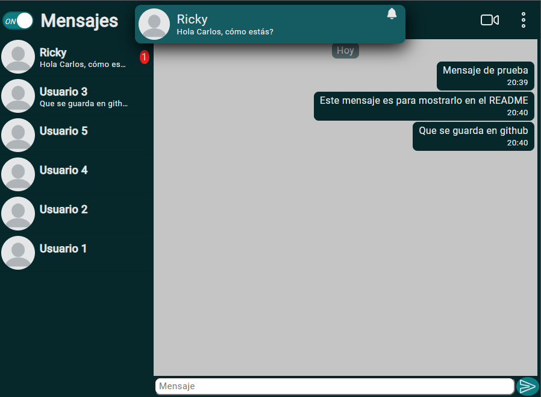
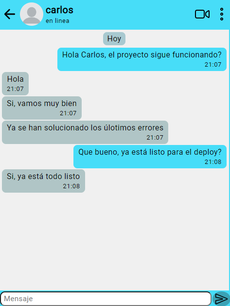

# Aplicación de chat 💬

## Acerca de la aplicación

Es una aplicación sencilla de mensajería instantánea que no guarda la información de manera permanente, esta aplicación la desarrolle para poner a prueba mis conocimientos, por eso no quise guardar los datos de los usuarios en una base de datos, se la podría agregar en una actualización futura, es solo una app de prueba.

La app tiene 5 usuarios agregados por defecto para probar el envío de mensajes, estos usuarios no realizan nada más en la aplicación.

### Caracteristicas

- ⚡ Mensajes instantáneos
- ⏳ Los datos son temporales
- 📹 Se pueden hacer videollamadas
- 🔔 Notificaciones de los mensajes entrantes en la app
- ✍ Estado en linea y escribiendo
- 🖼 Imagen de usuario
- 📆 Fecha y hora de los mensajes

 
Aplicación en version Escritorio mediano 💻 con tema Oscuro

 
Aplicación en version móvil 📱 con tema claro

 
Puedes regalarme una estrellita si te gusta el proyecto o si lo deseas
